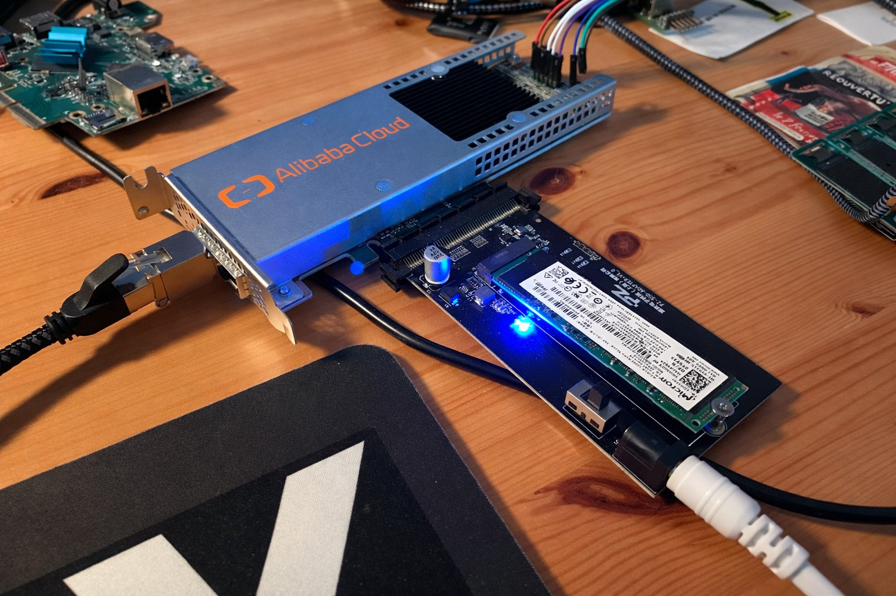
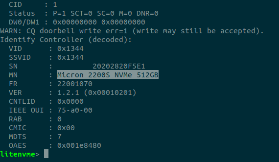

```
                               __   _ __      _  ___   ____  ___
                              / /  (_) /____ / |/ / | / /  |/  /__
                             / /__/ / __/ -_)    /| |/ / /|_/ / -_)
                            /____/_/\__/\__/_/|_/ |___/_/  /_/\__/

                           Small footprint LiteX based NVMe core.
                           Copyright (c) 2025-2026 Enjoy-Digital.
```


LiteNVMe is an **open-source NVMe host core** for FPGAs. It is the PCIe *RootPort* side: it
brings up an off-the-shelf NVMe SSD (controller enable, Identify, create the I/O queues) and lets
your logic read/write it through a simple block interface — **no host CPU, OS or driver on the
data path**. Most NVMe FPGA cores are the *device* (the SSD controller); open-source NVMe *host*
cores are rare (a few exist, e.g. DUNE's `pl-nvme`), and LiteNVMe is the LiteX-native one.

It is **functional and hardware-validated** at PCIe Gen3 x4 (~2.7 GB/s), and can be generated as a
**standalone Verilog core** for use outside LiteX.



*An Alibaba Cloud KU3P FPGA card driving a Micron NVMe SSD (PCIe), controlled over Ethernet.*

[> Status
---------

Validated end-to-end on real hardware (Alibaba KU3P + a commercial NVMe SSD) and in simulation
(`pytest`, 39 tests):

* PCIe link up (Gen3 x4, RootPort), BAR0 discovery, NVMe controller enable.
* Admin Identify + create I/O SQ/CQ; read/write with DMA to/from the host-memory window.
* Hardware I/O engine (QD 32) and the block-streaming interface; write→read-back bit-exact.
* **Two bring-up paths** (pick at build time): **firmware** on the embedded soft-CPU (default,
  easiest to extend) or a **pure-RTL init sequencer** (`--with-rtl-init`, fully CPU-less) — both
  HW-validated end to end.



[> Performance
--------------

Alibaba KU3P (XCKU3P) + Crucial CT500P310SSD8, Gen3 x4 / 256-bit @ 125 MHz:

| Workload            | Result                     |
|---------------------|----------------------------|
| 8 KiB reads (QD32)  | **~2.69 GB/s**, errors = 0 |
| 8 KiB writes (QD32) | **~2.74 GB/s**, errors = 0 |
| Integrity           | write → read-back exact     |

That is ~80 % of the usable Gen3 x4 link. The rest is the SSD's 512-byte MaxPayloadSize (read TLP
fragmentation) — the design is device/link-bound, not core-bound (`doc/NVME_PERFORMANCE.md`).

[> Resources
------------

Standalone core (`litenvme_core`, default config: 256 KiB window + bring-up CPU, XCKU3P,
out-of-context synth), broken down by block:

| Block | LUT | FF | BRAM | URAM | DSP |
|-------|----:|---:|-----:|-----:|----:|
| PCIe hard IP (`pcie4_uscale_plus` + GTY) | 2,960 | 6,303 | 22 | 0 | 0 |
| VexRiscv bring-up CPU (+ ROM/RAM)        | 1,695 |   749 | ~25 | 0 | 0 |
| 256 KiB host-memory window               |   —   |   —   | ~64 | 0 | 0 |
| NVMe datapath + I/O engine + block streamer + FIFOs | ~6,920 | ~7,360 | ~22 | 0 | 0 |
| **Total**                                | **11,577** | **14,408** | **133** | **0** | **0** |

LUT/FF + BRAM only (**0 URAM, 0 DSP**) — ports cleanly across Ultrascale+. BRAM is the tunable
cost: the 256 KiB window dominates (move it to URAM/DDR via `hostmem_backend`), and the **CPU-less
RTL-init** path (`--with-rtl-init`) drops the soft-CPU entirely — HW-measured saving of
**−2,560 LUT / −25 BRAM** (→ ~108 BRAM standalone). The 22-tile PCIe IP is the Xilinx hard block
(commercial cores tally it separately). Full analysis incl. the vs-Design-Gateway breakdown:
`doc/STANDALONE_CORE.md` §5 and `doc/NVME_CORE_COMPARISON.md`.

[> Interface
------------

The standalone core exposes (Gen3 x4, 256-bit):

```
  pcie_clk_p/n, pcie_rx_p/n[3:0], pcie_tx_p/n[3:0], rst_n   PCIe pads (rst_n = PERST# to the SSD)
  clk, rst                                                  system clock/reset (from PCIe)
  status_init_done, status_init_error                       1 once NVMe bring-up completed

  block_ctrl_{start, write, sector[63:0], count[31:0], nsid}   command in
  block_ctrl_{done, busy, error}                              status out
  block_wr_axis_{tvalid, tready, tlast, tdata[255:0]}         write payload in  (AXI-Stream)
  block_rd_axis_{tvalid, tready, tlast, tdata[255:0]}        read payload out (AXI-Stream)
```

To transfer: wait for `status_init_done`, set `{write, sector, count}`, pulse `block_ctrl_start`,
stream `count*512` bytes on `block_wr_axis` (write) or consume them on `block_rd_axis` (read),
then wait for `block_ctrl_done` and check `block_ctrl_error`. 1 sector = 512 B; 32 B per beat.

[> Using it
-----------

Requires Python 3.8+, FPGA vendor tools, and LiteX (see the LiteX wiki).

**1. Generate a standalone core** (Verilog + C headers, no Migen/LiteX needed to integrate it):

```sh
litenvme_gen examples/alibaba_xcku3p.yml --output-dir build --name litenvme_core
```

Add `build/gateware/litenvme_core.v` to your project, generate the `pcie4_uscale_plus` IP with the
emitted `.tcl`, wire the PCIe pads + block interface, and build. Steps: `doc/STANDALONE_CORE.md` §4.

**2. Build the reference test SoC** (Alibaba KU3P) and drive it over Ethernet/Etherbone:

```sh
./bench/alibaba_xcku3p.py --with-cpu --cpu-boot=bios --with-etherbone \
    --with-io-engine --with-block-streamer --csr-csv=csr.csv --build --load
./bench/hw_block.sh                                    # bring-up + throughput + correctness
python3 bench/test_block.py --isolated                # write/scrub/read-back proof
```

**2b. CPU-less (pure-RTL init)** — same SoC with `--with-rtl-init` and no CPU; a hardware
sequencer brings the SSD up (no firmware):

```sh
./bench/alibaba_xcku3p.py --with-etherbone --with-io-engine --with-rtl-init \
    --csr-csv=csr.csv --build --load
./bench/hw_rtlinit.sh        # RTL bring-up (init_done) + a read, all over Etherbone
```

**3. Use it as a LiteX package** — instantiate `LiteNVMe(pcie_endpoint, ...)` (`litenvme/core.py`)
on a `LitePCIeRootPort`; `bench/alibaba_xcku3p.py` is the worked example.

[> How it compares
------------------

Versus closed-source commercial NVMe *host* IP cores: on Gen3 x4 LiteNVMe reaches comparable,
near-link-ceiling throughput in a similar resource class — while being open source. Higher
absolute numbers elsewhere (7–11 GB/s) come from Gen4/Gen5/x8 PCIe, not a different architecture.
One real difference: some cores do NVMe init in pure RTL (no CPU); LiteNVMe uses a small bring-up
CPU (a pure-RTL init sequencer is on the roadmap). Details: `doc/NVME_CORE_COMPARISON.md`.

[> Documentation
----------------

| Doc | Contents |
|-----|----------|
| `doc/ARCHITECTURE.md`         | As-built Gen3-256b architecture (datapath, accessors, engine). |
| `doc/STANDALONE_CORE.md`      | Generation, interface, usage, integration flow, resources. |
| `doc/NVME_PERFORMANCE.md`     | Throughput study, the 512 B MPS ceiling, transfer-size sweep. |
| `doc/NVME_CORE_COMPARISON.md` | Comparison with other public NVMe cores (sourced, with caveats). |
| `doc/PROGRESS.md`             | Development log. |

[> Roadmap
----------

* PCIe Gen4 / Gen5 and wider lanes (PHY + datapath scaling) for higher throughput.
* Widen the RTL init sequencer's SSD coverage (read `CAP.DSTRD` / BAR type instead of assuming
  the common case) so the CPU-less path matches the firmware's broad SSD support.
* Multi-chunk transfers larger than the staging window; DDR/LiteDRAM-backed host memory.

Want to support or accelerate these? Contact us at florent [AT] enjoy-digital.fr.

[> Tests
--------

```sh
$ pytest -q          # full simulation suite (39 tests)
```

[> License
----------

LiteNVMe is released under the very permissive two-clause BSD license. Under
the terms of this license, you are authorized to use LiteNVMe for closed-source
proprietary designs.

Even though we do not require you to do so, those things are awesome, so please
do them if possible:

* tell us that you are using LiteNVMe
* cite LiteNVMe in publications related to research it has helped
* send feedback and suggestions for improvements
* send bug reports when something goes wrong
* send modifications and improvements you have done to LiteNVMe.

[> Support and consulting
-------------------------

LiteNVMe is developed and maintained by EnjoyDigital.

If you would like to know more about LiteNVMe or extend it for your needs,
EnjoyDigital can provide standard commercial support as well as consulting services.

So feel free to contact us, we'd love to work with you!

[> Contact
----------

E-mail: florent [AT] enjoy-digital.fr
