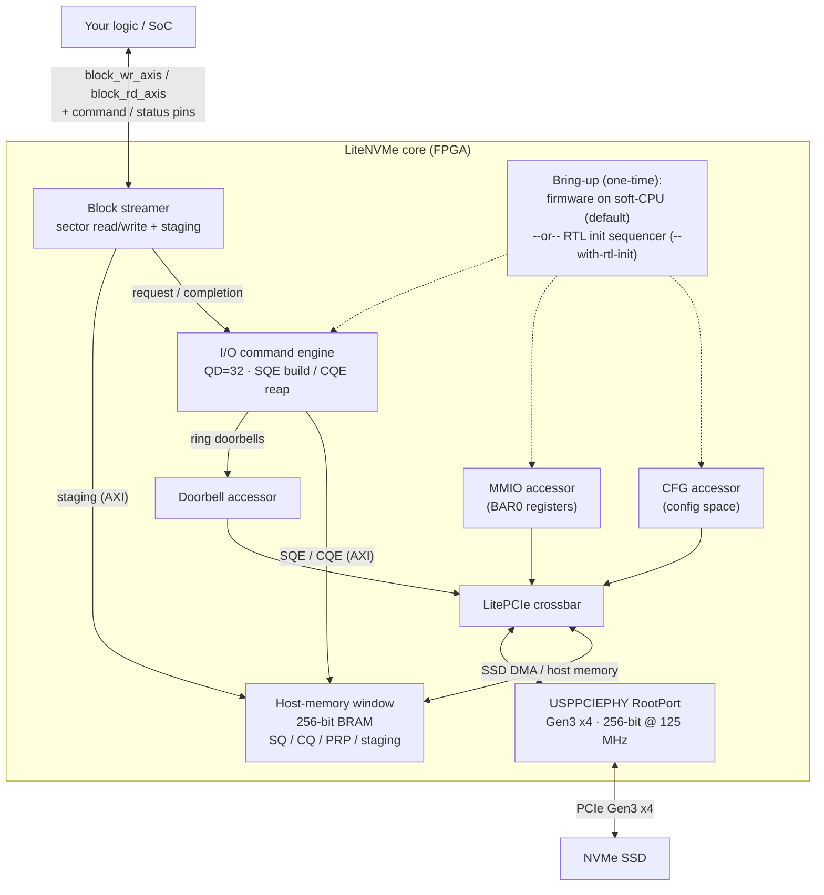
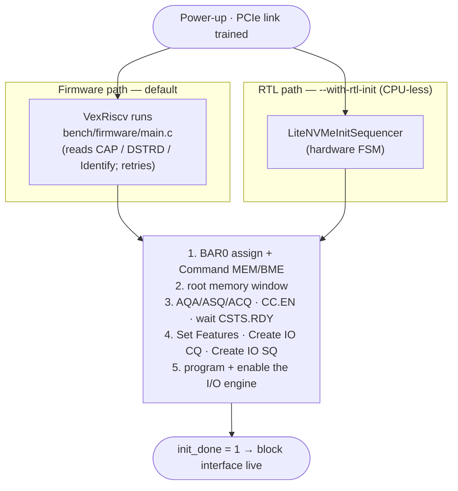
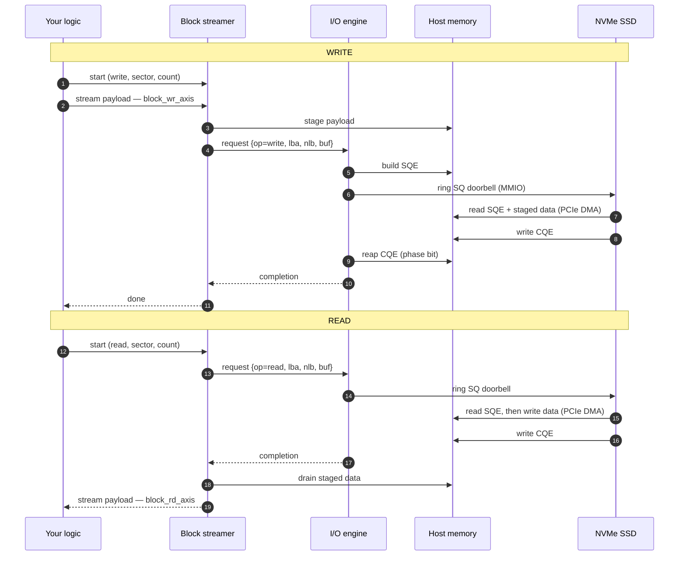
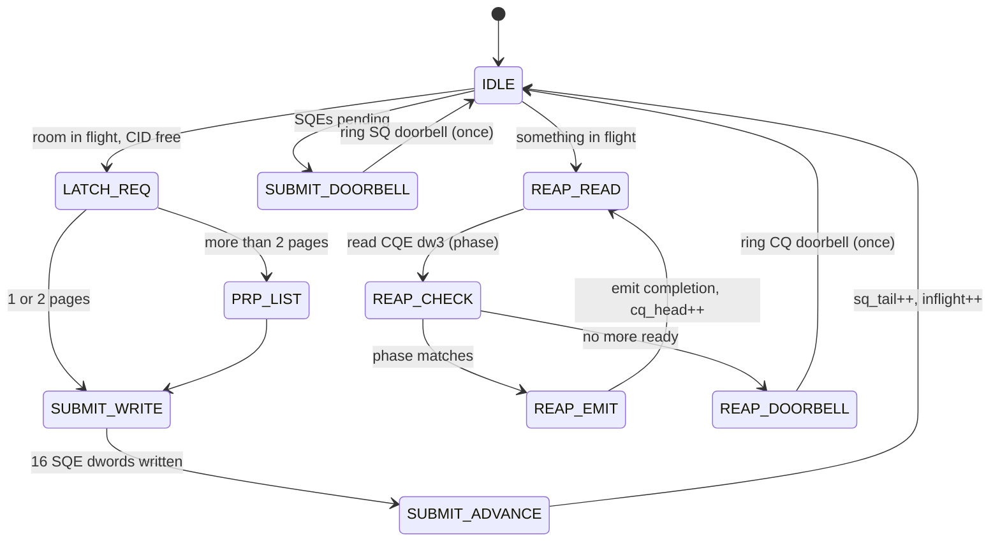
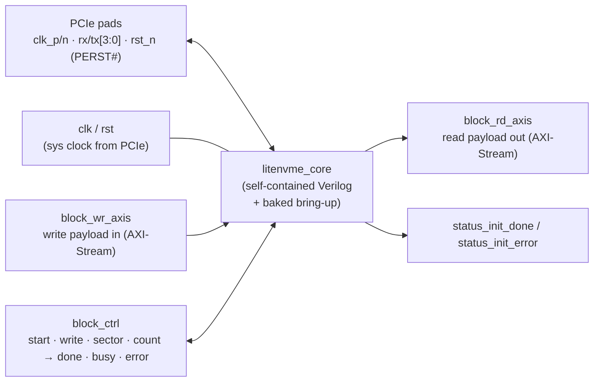

<!--
This file is part of LiteNVMe.
Copyright (c) 2026 Florent Kermarrec <florent@enjoy-digital.fr>
Developed with LLM assistance.
SPDX-License-Identifier: BSD-2-Clause
-->

# LiteNVMe — Architecture Diagrams

Visual overview of the current architecture (rendered by GitHub's Mermaid). For the as-built
details see [`ARCHITECTURE.md`](ARCHITECTURE.md); for the generated core see
[`STANDALONE_CORE.md`](STANDALONE_CORE.md).

---

## 1. System architecture

LiteNVMe is a PCIe **RootPort** NVMe **host**: it drives a commercial SSD and exposes a simple
block read/write interface to your logic.

**Two planes:**
- **Control plane** — `CFG` / `MMIO` accessors issue config + BAR0 requests *to* the SSD through
  the crossbar; the engine rings SQ/CQ doorbells via `DB`.
- **Data plane** — the SSD DMAs to/from the **host-memory window** (crossbar slave port); the I/O
  engine and the block streamer's staging also reach that window over an internal AXI arbiter.

---

## 2. Bring-up — two interchangeable paths

Both run the *same* NVMe init sequence and raise `init_done`; pick one at build time.

| | Firmware (default) | RTL init (`--with-rtl-init`) |
|---|---|---|
| Bring-up runs on | embedded soft-CPU (VexRiscv) | a hardware FSM, **no CPU** |
| SSD coverage | broad (reads CAP/DSTRD/BAR-type/Identify) | common case (64-bit BAR, DSTRD=0) |
| Easy to extend (new admin cmds) | yes (C) | RTL change |
| Resources | +CPU (~1.7k LUT + ~25 BRAM) | ~−2,560 LUT / −25 BRAM |

---

## 3. Block transfer — write then read

How a `{write/read, sector, count}` command flows end to end.

---

## 4. I/O command engine (QD) — state machine

The engine keeps up to `qd` (32) commands in flight with **no CPU in the loop**: it builds SQEs,
rings the SQ doorbell once per burst (coalesced), reaps CQEs by phase bit, and rings the CQ
doorbell once per batch.

---

## 5. Generated standalone core — top-level interface

`litenvme_gen <config>.yml` emits `litenvme_core.v` with these named ports (`data_width=256`).

> Usage: wait for `status_init_done`, drive `{write, sector, count}`, pulse `block_ctrl_start`,
> stream `count*512` bytes in/out, wait for `block_ctrl_done` (check `block_ctrl_error`).
> 1 sector = 512 B; the 256-bit bus carries 32 B/beat.
